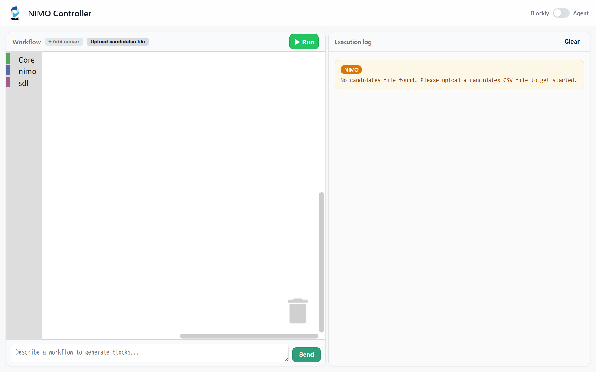
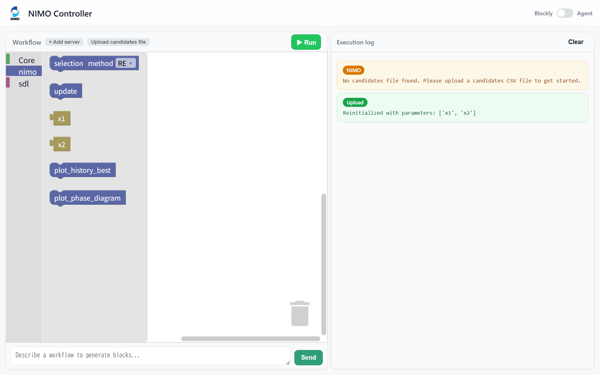
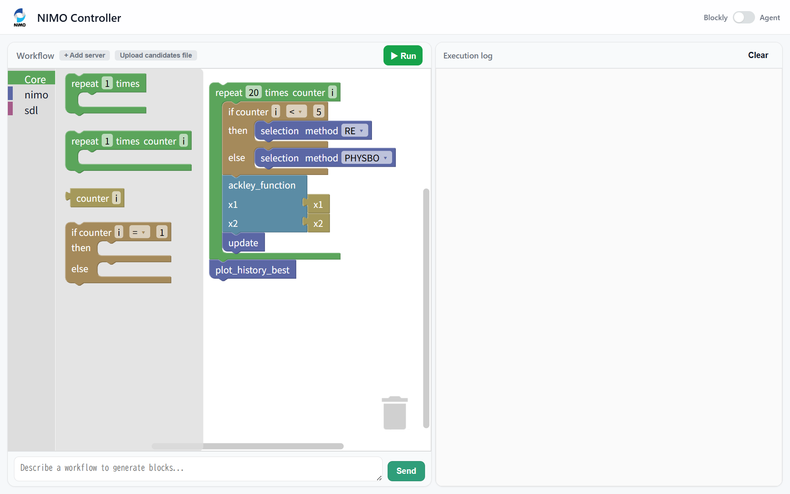
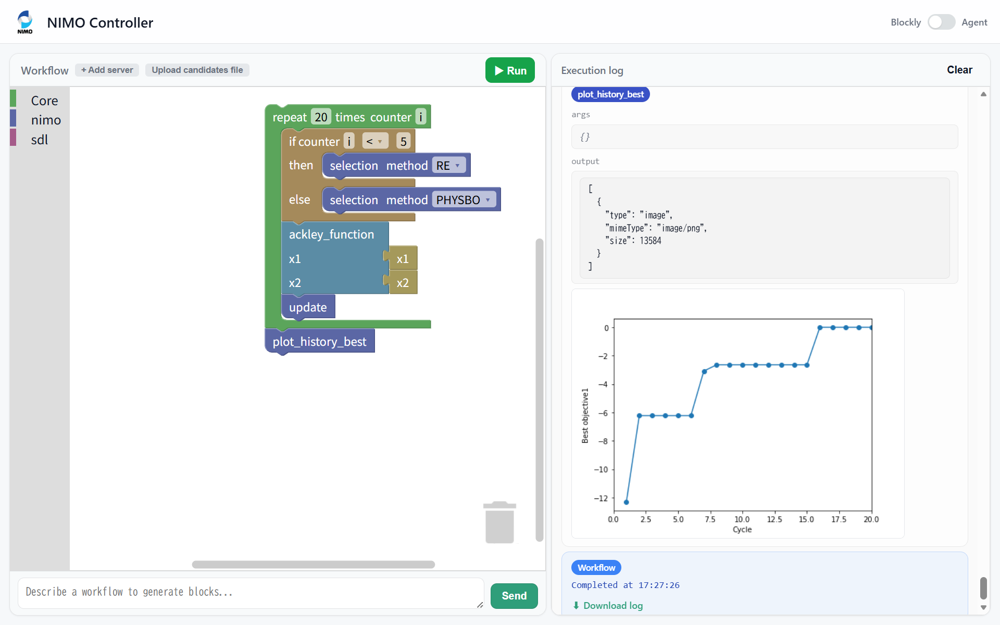
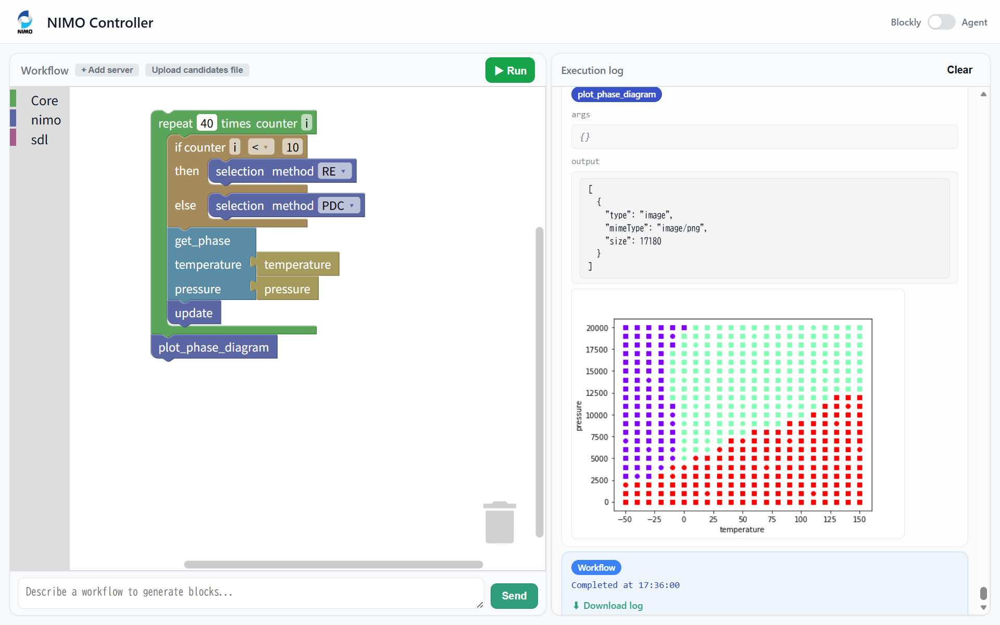

# nimo-controller

## Installation

Using [uv](https://docs.astral.sh/uv/) is recommended for development:

```
git clone https://github.com/NIMS-DA/nimo-controller.git
cd nimo-controller
uv sync
```

Alternatively, install using pip:
```
pip install nimo-controller
```

## Examples

### Bayesian optimization

The `example_mcp/ackley` directory contains an example MCP server that demonstrates how to use PHYSBO with the [Ackley function](https://en.wikipedia.org/wiki/Ackley_function).

Start the MCP server:

```
cd example_mcp/ackley
uv run mcp_ackley.py
```

In a separate terminal, launch NIMO Controller:

```
cd nimo-controller
uv run nimo-controller
```

Then open `http://127.0.0.1:8888/` in your browser.
At this point you will see a warning indicating that no candidates file has been loaded yet.



Click the `Upload candidates file` button and upload `example_mcp/ackley/candidates.csv`.
Once uploaded, the `x1` and `x2` blocks will appear in the NIMO toolbox.



Use the blocks to build the workflow shown below:



Press the `Run` button to execute the workflow.



Note that the target is the *negated* Ackley function, since PHYSBO performs maximization.

The same example is also provided written against the official MCP SDK, using plain decorated functions rather than an SDL class:

```
cd example_mcp/ackley
uv run mcp_ackley_sdk.py
```

It serves the same tool on the same port and uses the same candidates file, so the workflow above is unchanged — run one server or the other.

### Phase diagram construction

The `example_mcp/phase_diagram` directory contains an example MCP server that demonstrates the PDC algorithm by constructing a phase diagram for the fictional material X described in the [IvoryOS integration guide](https://nims-da.github.io/nimo/en/ivoryos.html).

Start the MCP server:

```
cd example_mcp/phase_diagram
uv run mcp_phase_diagram.py
```

Restart NIMO Controller, then upload `example_mcp/phase_diagram/candidates.csv` via the `Upload candidates file` button.

Build the workflow shown below. After running the workflow, a phase diagram will be constructed.



## Configuration

Configuration is loaded from the following sources, in order of precedence:

1. The path specified by `--config <path>`
2. `./config.yaml` in the current directory
3. `<user-config-dir>/nimo-controller/config.yaml` (for example, `~/.config/nimo-controller/config.yaml`)
4. The default configuration bundled with the package

Example `config.yaml`:

```yaml
port: 8888

mcp_servers:
  sdl: "http://127.0.0.1:8001/mcp"

# Optional: where candidates.csv and results/ are stored.
# Defaults to ~/.nimo-controller if omitted.
# data_dir: "~/my-nimo-data"
```

Runtime data — the uploaded `candidates.csv` and the optimization `results/` — is written to `~/.nimo-controller/` by default, regardless of where you launch the app from. You can change this by setting `data_dir` in `config.yaml`. The exact location is also shown in the UI when you click **Upload candidates file**.
