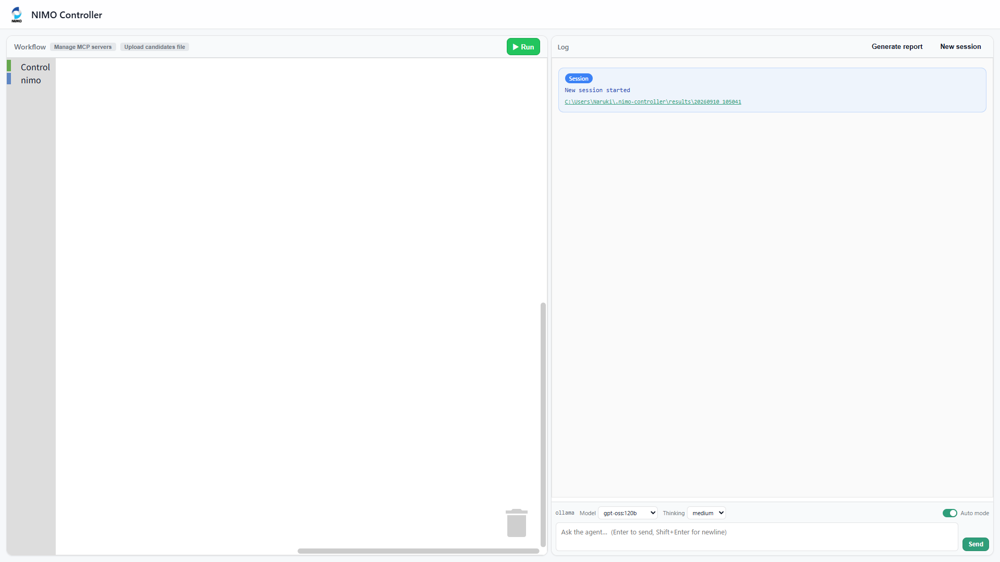
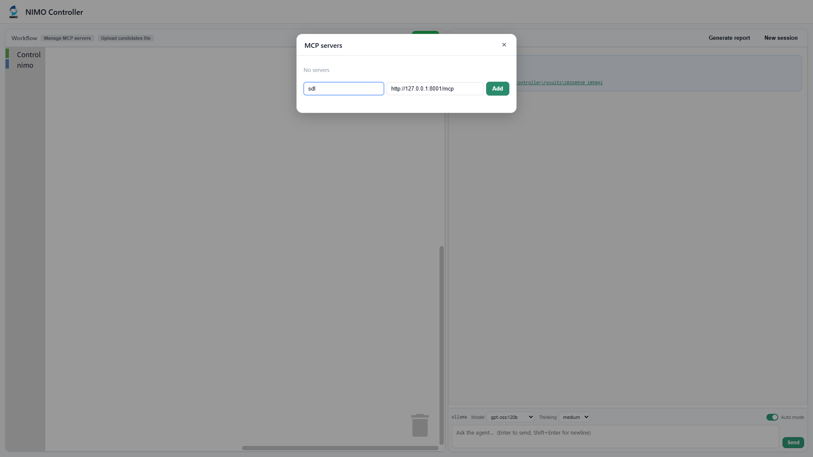
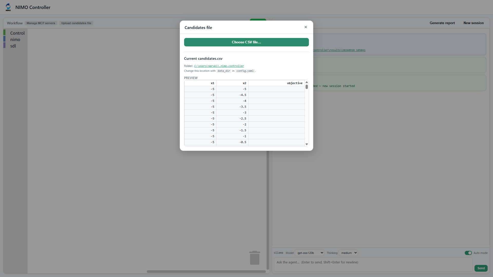
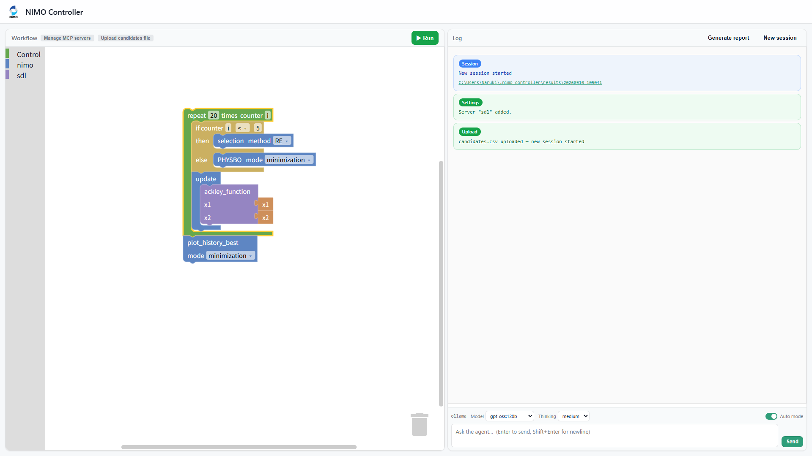
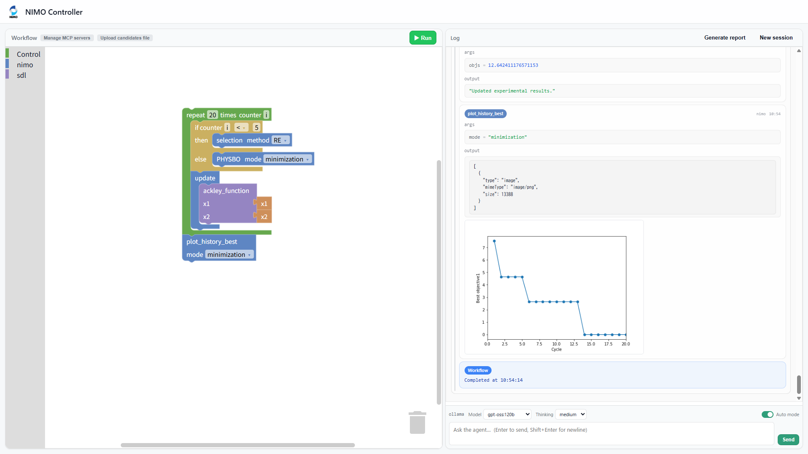

# nimo-controller

## Installation

Using [uv](https://docs.astral.sh/uv/) is recommended for development:

```
git clone https://github.com/NIMS-DA/nimo-controller.git
cd nimo-controller
uv sync
```

## Examples

### Bayesian optimization

The `example_mcp/optimization` directory contains an example MCP server that implements the two-dimensional [test functions for optimization](https://en.wikipedia.org/wiki/Test_functions_for_optimization).

Start the MCP server:

```
cd example_mcp/optimization
uv run mcp_test_function.py
```

In a separate terminal, launch NIMO Controller:

```
cd nimo-controller
uv run nimo-controller
```

Then open `http://127.0.0.1:8888/` in your browser.
You will see an empty screen. The agent text box will appear when `enable_agent` is set `true` in the configuration.



First, you need to add the MCP server. Click `Manage MCP servers` button and type a name for MCP server and `http://127.0.0.1:8001/mcp` as its URL. 



Click the `Upload candidates file` button and upload `example_mcp/optimization/candidates.csv`.
Once uploaded, the `x1` and `x2` blocks will appear in the NIMO toolbox.



Use the blocks to build the workflow shown below:



Press the `Run` button to execute the workflow.



## Configuration

Configuration is loaded from the following sources, in order of precedence:

1. `./config.yaml` in the current directory
2. `<user-config-dir>/nimo-controller/config.yaml` (for example, `~/.config/nimo-controller/config.yaml`)
3. Built-in defaults (used when no config file exists)

Example `config.yaml`:

```yaml
port: 8888

mcp_servers:
  sdl: "http://127.0.0.1:8001/mcp"

enable_agent: true

agent:
  provider: ollama
  base_url: "http://127.0.0.1:11434/v1"

# Optional: where candidates.csv and results/ are stored.
# Defaults to ~/.nimo-controller if omitted.
# data_dir: "~/my-nimo-data"
```